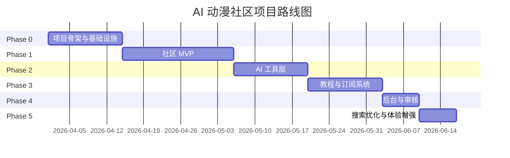

# AI 动漫社区项目路线图

> 版本：v1.0
> 更新时间：2026-04-16
> 适用范围：v1 MVP 阶段
> 详细执行文档：[ai_anime_community_execution_v1_optimized.md](./design-docs/ai_anime_community_execution_v1_optimized.md)

---

## 路线图概览

---

## Phase 0: 项目骨架与基础设施

**目标**: 把工程底盘搭起来，确保后续开发有统一规范。

**执行计划**: [EP-000-foundation-setup.md](./exec-plans/active/EP-000-foundation-setup.md)

**关键任务**:
- [x] Monorepo 初始化 (apps/web, apps/api, apps/worker)
- [x] 仓库治理初始化 (AGENTS.md, ARCHITECTURE.md)
- [x] 工程规范配置 (ESLint, Prettier, TypeScript)
- [x] 基础服务接通 (PostgreSQL, Redis, Clerk, Stripe)
- [x] 数据库初始化 (Alembic, 基础表模型 + 计费模型)
- [x] API 基础设施 (routers, schemas 骨架)
- [x] Docker 支持 (Dockerfile, docker-compose)
- [ ] CI/CD Preview 环境部署

**DoD**:
- [x] 三端 (web / api / worker) 本地可启动
- [x] CI 基础流水线通过
- [x] 基础文档入口已存在
- [x] 第一版 DB migration 配置已就绪
- [x] 团队可按文档独立完成本地环境搭建

**状态**: ✅ 已完成 (Preview 环境待部署)

---

## Phase 1: 社区 MVP

**目标**: 跑通"注册 → 发帖 → 浏览 → 评论 → 互动"的社区主闭环。

**执行计划**: 
- 后端: 待创建 `EP-002-community-mvp.md`
- 前端: [EP-001frontend-implementation.md](./exec-plans/active/EP-001frontend-implementation.md) (Phase 1 章节)

**关键任务**:

### 1.0 前端迁移与基础设施
- [ ] 迁移 UI 组件 (48 个 shadcn/ui)
- [ ] 迁移样式系统 (fonts.css, theme.css)
- [ ] 迁移通用组件 (Header, Layout, ImageWithFallback)
- [ ] 迁移业务组件 (WorkCard, CommentSection, AIChatPanel)

### 1.1 用户体系
- [ ] Clerk 登录注册页面
- [ ] Clerk webhook 同步
- [ ] `/me` 与 profile 更新接口
- [ ] 创作者主页
- [ ] 设置页

### 1.2 作品发布
- [ ] 上传签名接口
- [ ] 前端直传对象存储
- [ ] 上传完成回调
- [ ] 创建帖子接口
- [ ] 发帖表单页面
- [ ] 编辑作品页

### 1.3 作品展示
- [ ] 首页最新流
- [ ] 作品详情页
- [ ] 标签页
- [ ] 创作者主页作品流
- [ ] 搜索页

### 1.4 评论与互动
- [ ] 评论列表/发表接口
- [ ] 评论组件
- [ ] 点赞/收藏接口
- [ ] 前端互动状态同步

### 1.5 基础审核能力
- [ ] 发帖后 processing 状态
- [ ] Worker 占位任务
- [ ] flagged 内容过滤

**DoD**:
- [ ] 用户可登录
- [ ] 用户可上传并发布作品
- [ ] 用户可浏览、评论、点赞、收藏
- [ ] 作品详情页与创作者主页可用
- [ ] 基础发布闭环跑通
- [ ] 所有参考页面已迁移到 Next.js

**状态**: ⚪ 未开始

---

## Phase 2: AI 工具层

**目标**: 把 AI 做成真正的产品能力，而不是外挂聊天框。

**执行计划**: 待创建 `EP-003-ai-layer-v1.md`

**关键任务**:

### 2.1 AI Gateway
- [ ] Provider 抽象
- [ ] 模型配置中心
- [ ] 统一调用日志
- [ ] 超时/重试/fallback

### 2.2 Prompt 资产化
- [ ] `write_post` prompt 模板
- [ ] `write_comment` prompt 模板
- [ ] `site_search` prompt 模板
- [ ] 结构化输出 schema
- [ ] 初始 eval cases

### 2.3 配额系统
- [ ] quota_accounts 表接入
- [ ] quota_transactions 入账逻辑
- [ ] 场景级扣减规则
- [ ] `/ai/quota` 接口

### 2.4 AI 功能实现
- [ ] `POST /ai/write-post`
- [ ] `POST /ai/write-comment`
- [ ] `POST /ai/site-search`
- [ ] AI 会话与消息日志入库

### 2.5 前端集成
- [ ] 发帖页 AI 生成描述
- [ ] 评论框 AI 生成评论
- [ ] 站内搜索 AI 问答入口
- [ ] AI 结果可复制/回填

**DoD**:
- [ ] 三个 AI 接口可用
- [ ] 用户可在前台直接调用 AI 能力
- [ ] token 与配额可追踪
- [ ] AI 日志可在后台查看基础记录

**状态**: ⚪ 未开始

---

## Phase 3: 教程与订阅系统

**目标**: 把"付费教程 + 会员 + AI 额度"真正打通。

**执行计划**: 待创建 `EP-004-tutorial-subscription.md`

**关键任务**:

### 3.1 教程系统
- [ ] tutorials 表与 chapters 表落地
- [ ] 教程创建/编辑/发布接口
- [ ] 教程详情页
- [ ] 试看章节逻辑

### 3.2 会员系统
- [ ] membership_plans 配置
- [ ] 会员页展示套餐
- [ ] checkout 创建接口
- [ ] 当前订阅接口

### 3.3 Stripe 接入
- [ ] Stripe product/price 初始化
- [ ] webhook 验签
- [ ] payment_events 入库
- [ ] subscriptions 状态同步
- [ ] entitlements 更新

### 3.4 AI 额度联动
- [ ] 订阅开通时重置 monthly quota
- [ ] 不同 plan 绑定不同额度
- [ ] 取消订阅后的周期处理逻辑

**DoD**:
- [ ] 教程内容发布与展示可用
- [ ] 会员购买流程可用
- [ ] webhook 驱动的订阅状态同步可用
- [ ] 会员教程访问权限和 AI 额度联动生效

**状态**: ⚪ 未开始

---

## Phase 4: 后台与审核

**目标**: 为运营提供基本可用的后台能力。

**执行计划**: 待创建 `EP-005-admin-moderation.md`

**关键任务**:

### 4.1 举报系统
- [ ] 举报接口
- [ ] 举报列表
- [ ] 举报详情
- [ ] 状态流转

### 4.2 审核系统
- [ ] moderation_cases 列表
- [ ] 决策接口
- [ ] 处置动作记录
- [ ] audit_logs 写入

### 4.3 后台管理台
- [ ] 管理员登录校验
- [ ] 用户列表
- [ ] 内容列表
- [ ] 订单/订阅查看
- [ ] AI 使用摘要看板

**DoD**:
- [ ] 管理员可查看举报与审核内容
- [ ] 管理员可对违规内容执行基本处置
- [ ] 可查看基础订阅与 AI 使用情况

**状态**: ⚪ 未开始

---

## Phase 5: 搜索优化与体验增强

**目标**: 提升内容发现效率和整体可用性。

**执行计划**: 待创建 `EP-006-search-experience.md`

**关键任务**:

### 5.1 搜索优化
- [ ] search_documents 全量生成
- [ ] tsvector 检索接入
- [ ] pgvector 召回接入
- [ ] lexical + semantic 合并排序

### 5.2 热门流与关注流
- [ ] 热门度快照任务
- [ ] trending 接口
- [ ] following feed 接口优化

### 5.3 产品体验
- [ ] 图片懒加载与压缩
- [ ] skeleton / loading states
- [ ] AI 结果流式展示（可选）
- [ ] SEO metadata 完善

**DoD**:
- [ ] 搜索质量明显提升
- [ ] 热门流、关注流更稳定
- [ ] 首页与详情页体验优化完成

**状态**: ⚪ 未开始

---

## 执行计划索引

| Plan ID | 名称 | Phase | 状态 | 文件 |
|---------|------|-------|------|------|
| EP-000 | 项目骨架与基础设施 | 0 | ✅ 已完成 | [EP-000-foundation-setup.md](./exec-plans/active/EP-000-foundation-setup.md) |
| EP-001-FE | 前端实施执行计划 | 0-5 | 🟡 进行中 | [EP-001frontend-implementation.md](./exec-plans/active/EP-001frontend-implementation.md) |
| EP-002 | 社区 MVP | 1 | ⚪ 待创建 | 待创建 |
| EP-003 | AI 工具层 | 2 | ⚪ 待创建 | 待创建 |
| EP-004 | 教程与订阅系统 | 3 | ⚪ 待创建 | 待创建 |
| EP-005 | 后台与审核 | 4 | ⚪ 待创建 | 待创建 |
| EP-006 | 搜索优化与体验增强 | 5 | ⚪ 待创建 | 待创建 |

---

## v1 成功标准

达到以下状态，可判定 v1 架构方向正确：

- [ ] 社区主闭环可稳定使用
- [ ] AI 功能可真实提升发帖/评论效率
- [ ] 会员购买后，教程权限与 AI 额度同步正确
- [ ] 管理员可完成基础审核与问题定位
- [ ] 仓库结构足够清晰，后续扩展不需要大规模推翻

---

## 风险与依赖

### 关键依赖

| 依赖 | 提供方 | 状态 |
|------|--------|------|
| Clerk 认证 | Clerk | ✅ 已配置 |
| Stripe 支付 | Stripe | ✅ 已配置 |
| 对象存储 | Cloudflare R2 | ✅ 已配置 |
| PostgreSQL | Railway/本地 | ✅ 已配置 |
| Redis | Railway/本地 | ✅ 已配置 |
| Sentry | Sentry | ✅ 已配置 |
| PostHog | PostHog | ✅ 已配置 |

### 主要风险点

| 风险 | 影响 | 预防措施 |
|------|------|----------|
| 上传状态不一致 | 资源孤儿、脏数据 | sign/complete 两段式 + 幂等 + 清理任务 |
| 支付状态错乱 | 权益未开通、重复记账 | payment_events 入库 + 幂等约束 + 补偿任务 |
| AI 成本失控 | 费用超预算 | quota check 前置 + 失败不扣减 + 场景级限流 |
| 搜索质量差 | 用户留存下降 | lexical + semantic hybrid + rerank |
| 仓库知识腐烂 | AI 读错规则、新成员困惑 | CI docs-check + CODEOWNERS + ADR 强制 |

---

*路线图版本：v1.0*
*更新时间：2026-04-16*
*维护者：项目团队*