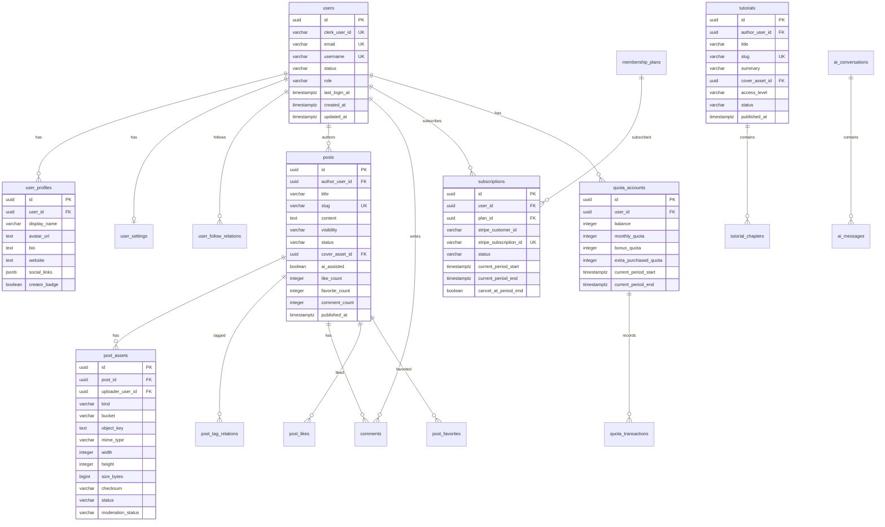

# 数据库 ER 图 v1

## 概述

v1 数据库设计包含以下领域：
- 用户与身份域
- 社区内容域
- 教程与订阅域
- AI 与配额域
- 搜索与发现域
- 审核与运营域

## ER 图

## 表数量统计

| 领域 | 表数量 |
|------|--------|
| 用户与身份域 | 4 |
| 社区内容域 | 8 |
| 教程与订阅域 | 6 |
| AI 与配额域 | 5 |
| 搜索与发现域 | 2 |
| 审核与运营域 | 4 |
| **总计** | **29** |

## 详细设计

详见 [schema-glossary.md](./schema-glossary.md)
