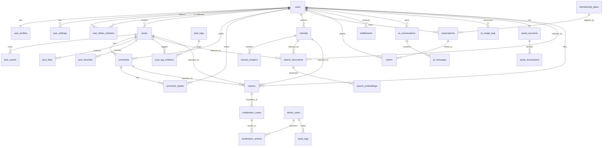
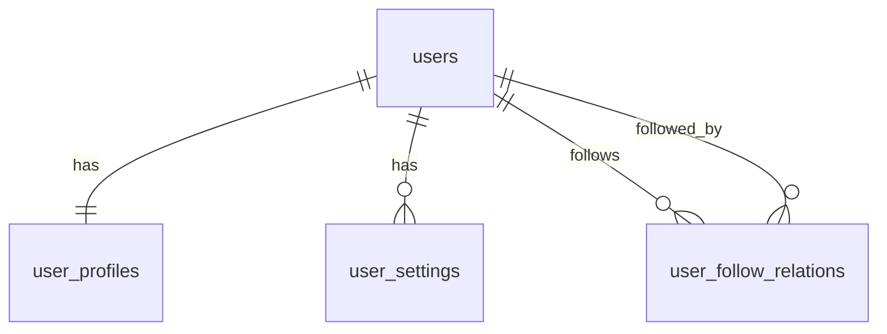
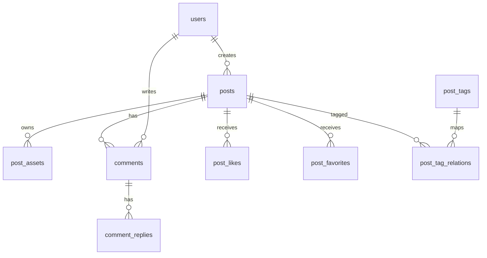
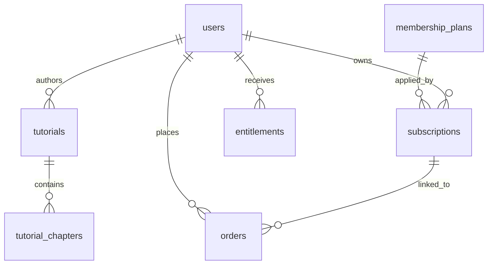
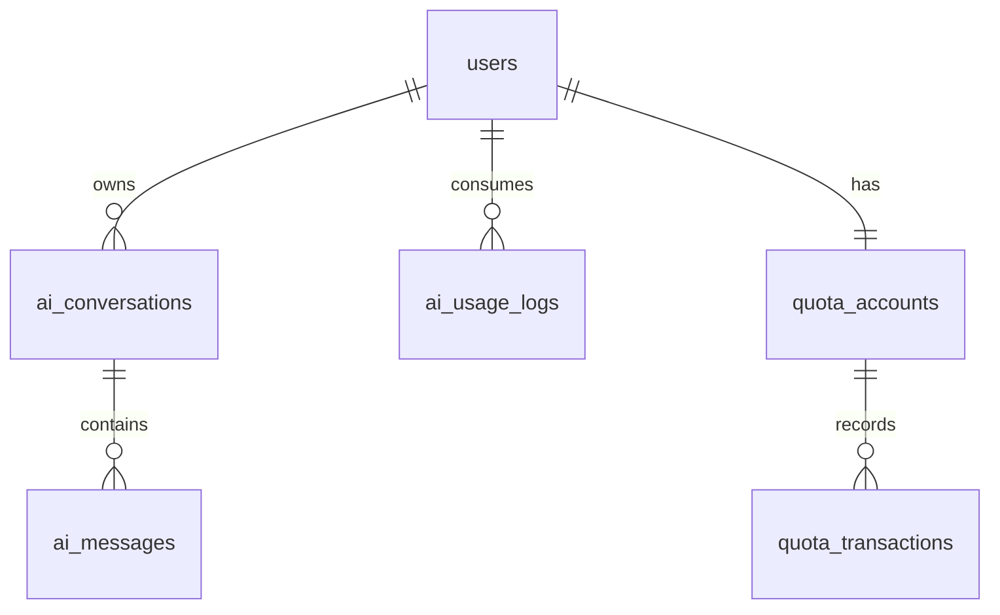
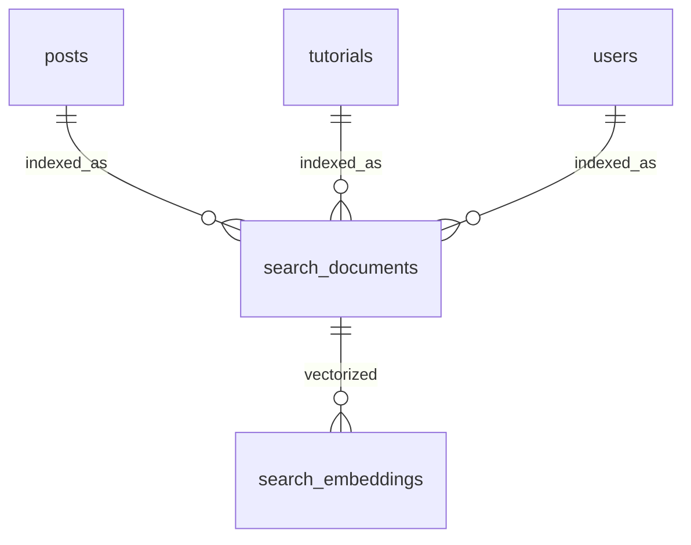
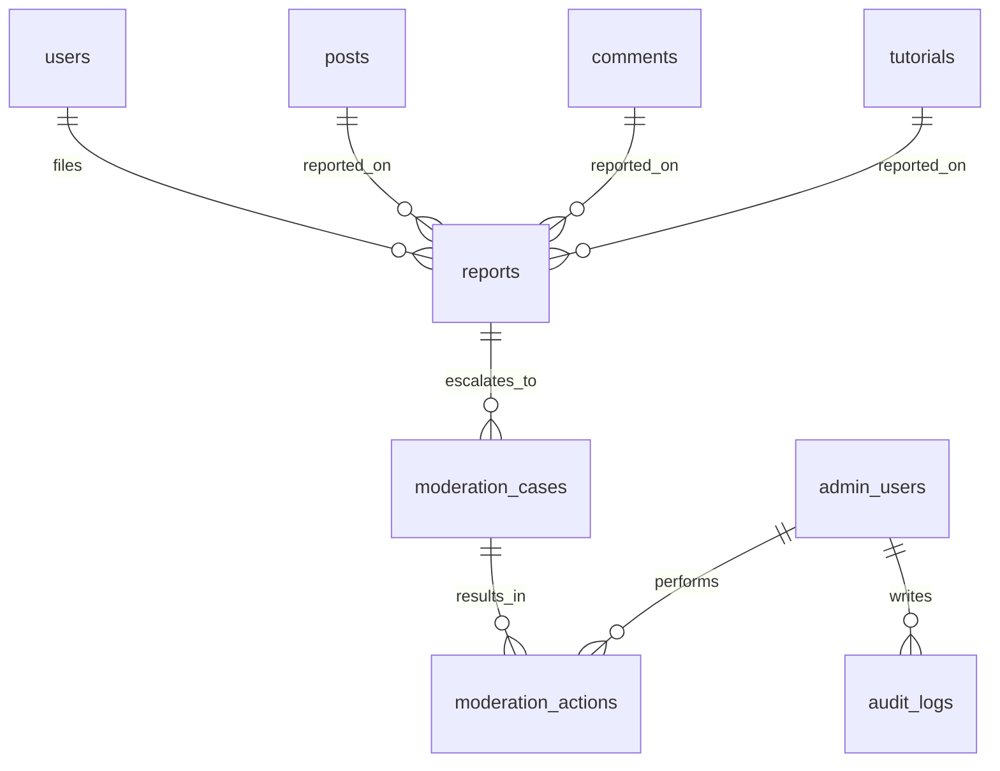

# AI Anime Community Database ERD v1

> Version: v1  
> Scope: Greenfield / 1–3 person team / community + subscription + AI assistant + moderation  
> Purpose: provide an executable database ERD document for schema design, migration ordering, API/backend implementation, and future indexing/search expansion.

---

# 1. Design goals

This ERD is designed for the v1 closed loop of the AI anime community project:

1. User registration/login and profile management
2. Creator posting artwork/content with image assets
3. Feed browsing, likes, favorites, comments, follows
4. Premium tutorials and membership subscriptions
5. AI-assisted writing and site Q&A with usage/quota tracking
6. Moderation, reports, admin actions, audit trails

The schema follows these constraints:

- **Single primary database**: PostgreSQL
- **Modular monolith friendly**: clear domain boundaries, not microservice-driven
- **Strong consistency for core business data**
- **Async-friendly**: upload processing, moderation, embeddings, search refresh handled out-of-band
- **Extensible**: can later add recommendation, notification, message center, creator monetization

---

# 2. Modeling principles

## 2.1 Core principles

- Distinguish **community content** from **premium tutorial content**
- Treat **auth provider identity** and **local business user model** separately
- Treat **payment source of truth** and **local entitlement execution** separately
- Treat **AI request logs**, **quota ledger**, and **conversation records** separately
- Treat **moderation cases** and **admin audit logs** separately

## 2.2 Naming conventions

- table names: `snake_case`, plural
- primary keys: `id` (UUID preferred)
- foreign keys: `<entity>_id`
- enum fields: varchar + application enum or PostgreSQL enum if stable
- timestamps: `created_at`, `updated_at`
- soft delete only where necessary; do not soft-delete everything by default

## 2.3 ID strategy

Recommended:

- `UUID` for most primary keys
- external integrations stored separately, e.g. `clerk_user_id`, `stripe_customer_id`, `stripe_subscription_id`

---

# 3. Domain map

The v1 database is split into 6 logical domains:

1. **Identity & User Domain**
2. **Community Content Domain**
3. **Tutorial & Subscription Domain**
4. **AI Domain**
5. **Search & Discovery Domain**
6. **Moderation & Admin Domain**

---

# 4. High-level ER diagram

---

# 5. Domain ER diagrams and table specs

# 5.1 Identity & User Domain

## 5.1.1 ER diagram

## 5.1.2 Tables

### `users`
Core business user record mirrored from auth provider.

| Column | Type | Notes |
|---|---|---|
| id | uuid pk | local user id |
| clerk_user_id | varchar unique | external auth id |
| email | varchar unique | normalized lowercase |
| username | varchar unique | public unique handle alias |
| status | varchar | active / suspended / deleted |
| role | varchar | user / creator / moderator / admin |
| last_login_at | timestamptz | optional |
| created_at | timestamptz | |
| updated_at | timestamptz | |

**Indexes**
- unique(`clerk_user_id`)
- unique(`email`)
- unique(`username`)
- index(`status`)

### `user_profiles`
Public-facing profile and creator metadata.

| Column | Type | Notes |
|---|---|---|
| id | uuid pk | |
| user_id | uuid fk -> users.id unique | 1:1 |
| display_name | varchar | |
| bio | text | |
| avatar_asset_key | varchar | object storage key |
| banner_asset_key | varchar nullable | |
| creator_level | varchar nullable | optional |
| website_url | varchar nullable | |
| social_links_json | jsonb nullable | |
| created_at | timestamptz | |
| updated_at | timestamptz | |

### `user_settings`
User preference storage.

| Column | Type | Notes |
|---|---|---|
| id | uuid pk | |
| user_id | uuid fk -> users.id | |
| key | varchar | e.g. theme, nsfw_blur, language |
| value_json | jsonb | |
| created_at | timestamptz | |
| updated_at | timestamptz | |

**Constraints**
- unique(`user_id`, `key`)

### `user_follow_relations`
Follow graph.

| Column | Type | Notes |
|---|---|---|
| id | uuid pk | |
| follower_user_id | uuid fk -> users.id | |
| followed_user_id | uuid fk -> users.id | |
| created_at | timestamptz | |

**Constraints**
- unique(`follower_user_id`, `followed_user_id`)
- check follower != followed

---

# 5.2 Community Content Domain

## 5.2.1 ER diagram

## 5.2.2 Tables

### `posts`
Community content entity for artwork/showcase posts.

| Column | Type | Notes |
|---|---|---|
| id | uuid pk | |
| author_user_id | uuid fk -> users.id | |
| title | varchar | |
| slug | varchar unique nullable | optional SEO slug |
| description | text | main caption/body |
| visibility | varchar | public / followers / private |
| publish_status | varchar | draft / processing / published / flagged / archived |
| cover_asset_id | uuid nullable fk -> post_assets.id | resolved after upload |
| like_count | integer default 0 | denormalized counter |
| favorite_count | integer default 0 | denormalized counter |
| comment_count | integer default 0 | denormalized counter |
| published_at | timestamptz nullable | |
| created_at | timestamptz | |
| updated_at | timestamptz | |

**Indexes**
- index(`author_user_id`, `publish_status`)
- index(`publish_status`, `published_at desc`)
- index(`visibility`, `published_at desc`)

### `post_assets`
Uploaded media assets associated with posts.

| Column | Type | Notes |
|---|---|---|
| id | uuid pk | |
| post_id | uuid fk -> posts.id | |
| storage_provider | varchar | r2 / s3 |
| bucket | varchar | |
| object_key | varchar unique | |
| kind | varchar | original / thumbnail / webp / avif / cover |
| mime_type | varchar | |
| width | integer nullable | |
| height | integer nullable | |
| size_bytes | bigint nullable | |
| processing_status | varchar | uploaded / processing / ready / failed |
| moderation_status | varchar | pending / approved / rejected |
| created_at | timestamptz | |
| updated_at | timestamptz | |

**Indexes**
- unique(`object_key`)
- index(`post_id`, `kind`)
- index(`processing_status`)
- index(`moderation_status`)

### `post_tags`
Canonical tags.

| Column | Type | Notes |
|---|---|---|
| id | uuid pk | |
| name | varchar unique | display tag |
| slug | varchar unique | SEO/search |
| category | varchar nullable | style / character / tool / fandom |
| created_at | timestamptz | |

### `post_tag_relations`
Many-to-many between posts and tags.

| Column | Type | Notes |
|---|---|---|
| id | uuid pk | |
| post_id | uuid fk -> posts.id | |
| tag_id | uuid fk -> post_tags.id | |
| created_at | timestamptz | |

**Constraints**
- unique(`post_id`, `tag_id`)

### `comments`
Top-level comments.

| Column | Type | Notes |
|---|---|---|
| id | uuid pk | |
| post_id | uuid fk -> posts.id | |
| author_user_id | uuid fk -> users.id | |
| body | text | |
| status | varchar | visible / hidden / deleted / flagged |
| like_count | integer default 0 | optional future |
| created_at | timestamptz | |
| updated_at | timestamptz | |

**Indexes**
- index(`post_id`, `created_at asc`)
- index(`author_user_id`, `created_at desc`)
- index(`status`)

### `comment_replies`
Replies separated from top-level comments to keep feed/query logic simple in v1.

| Column | Type | Notes |
|---|---|---|
| id | uuid pk | |
| comment_id | uuid fk -> comments.id | parent top-level comment |
| author_user_id | uuid fk -> users.id | |
| body | text | |
| status | varchar | visible / hidden / deleted / flagged |
| created_at | timestamptz | |
| updated_at | timestamptz | |

### `post_likes`
Like relation.

| Column | Type | Notes |
|---|---|---|
| id | uuid pk | |
| post_id | uuid fk -> posts.id | |
| user_id | uuid fk -> users.id | |
| created_at | timestamptz | |

**Constraints**
- unique(`post_id`, `user_id`)

### `post_favorites`
Favorite/bookmark relation.

| Column | Type | Notes |
|---|---|---|
| id | uuid pk | |
| post_id | uuid fk -> posts.id | |
| user_id | uuid fk -> users.id | |
| created_at | timestamptz | |

**Constraints**
- unique(`post_id`, `user_id`)

---

# 5.3 Tutorial & Subscription Domain

## 5.3.1 ER diagram

## 5.3.2 Tables

### `tutorials`
Premium or public educational content.

| Column | Type | Notes |
|---|---|---|
| id | uuid pk | |
| author_user_id | uuid fk -> users.id | optional internal staff/creator |
| title | varchar | |
| slug | varchar unique | |
| summary | text | |
| access_level | varchar | public / member / premium |
| status | varchar | draft / published / archived |
| cover_asset_key | varchar nullable | |
| chapter_count | integer default 0 | denormalized |
| published_at | timestamptz nullable | |
| created_at | timestamptz | |
| updated_at | timestamptz | |

### `tutorial_chapters`
Tutorial content split into chapters.

| Column | Type | Notes |
|---|---|---|
| id | uuid pk | |
| tutorial_id | uuid fk -> tutorials.id | |
| title | varchar | |
| content_md | text | markdown or rich text |
| sort_order | integer | |
| is_preview | boolean default false | teaser section |
| created_at | timestamptz | |
| updated_at | timestamptz | |

**Constraints**
- unique(`tutorial_id`, `sort_order`)

### `membership_plans`
Commercial membership plan definitions.

| Column | Type | Notes |
|---|---|---|
| id | uuid pk | |
| code | varchar unique | monthly_basic / monthly_plus |
| name | varchar | |
| price_amount | integer | minor unit |
| currency | varchar | e.g. usd |
| billing_interval | varchar | month / year |
| ai_quota_monthly | integer | included credits |
| tutorial_access_level | varchar | member / premium |
| is_active | boolean | |
| stripe_price_id | varchar unique nullable | external mapping |
| created_at | timestamptz | |
| updated_at | timestamptz | |

### `subscriptions`
Local subscription mirror.

| Column | Type | Notes |
|---|---|---|
| id | uuid pk | |
| user_id | uuid fk -> users.id | |
| plan_id | uuid fk -> membership_plans.id | |
| stripe_customer_id | varchar | |
| stripe_subscription_id | varchar unique | |
| status | varchar | trialing / active / past_due / canceled / incomplete |
| current_period_start | timestamptz nullable | |
| current_period_end | timestamptz nullable | |
| canceled_at | timestamptz nullable | |
| created_at | timestamptz | |
| updated_at | timestamptz | |

**Indexes**
- unique(`stripe_subscription_id`)
- index(`user_id`, `status`)

### `orders`
Payment/order level records.

| Column | Type | Notes |
|---|---|---|
| id | uuid pk | |
| user_id | uuid fk -> users.id | |
| subscription_id | uuid nullable fk -> subscriptions.id | |
| order_type | varchar | subscription / one_time_credits |
| provider | varchar | stripe |
| provider_order_id | varchar | checkout session / payment intent etc |
| amount | integer | minor unit |
| currency | varchar | |
| status | varchar | pending / paid / failed / refunded |
| paid_at | timestamptz nullable | |
| created_at | timestamptz | |
| updated_at | timestamptz | |

### `payment_events`
Raw or normalized provider events for audit/idempotency.

| Column | Type | Notes |
|---|---|---|
| id | uuid pk | |
| provider | varchar | stripe |
| provider_event_id | varchar unique | webhook event id |
| event_type | varchar | |
| payload_json | jsonb | |
| processed_status | varchar | pending / processed / failed |
| processed_at | timestamptz nullable | |
| created_at | timestamptz | |

### `entitlements`
Resolved local access rights.

| Column | Type | Notes |
|---|---|---|
| id | uuid pk | |
| user_id | uuid fk -> users.id | |
| source_type | varchar | subscription / grant / manual |
| source_id | uuid nullable | e.g. subscription id |
| entitlement_code | varchar | tutorial.member / tutorial.premium / ai.quota.boost |
| status | varchar | active / expired / revoked |
| starts_at | timestamptz | |
| ends_at | timestamptz nullable | |
| created_at | timestamptz | |
| updated_at | timestamptz | |

**Indexes**
- index(`user_id`, `status`)
- index(`entitlement_code`, `status`)

---

# 5.4 AI Domain

## 5.4.1 ER diagram

## 5.4.2 Tables

### `ai_conversations`
Conversation container for chat/session history.

| Column | Type | Notes |
|---|---|---|
| id | uuid pk | |
| user_id | uuid fk -> users.id | |
| scene | varchar | site_chat / write_post / write_comment |
| title | varchar nullable | optional auto-generated |
| status | varchar | active / archived |
| created_at | timestamptz | |
| updated_at | timestamptz | |

### `ai_messages`
Chat message records.

| Column | Type | Notes |
|---|---|---|
| id | uuid pk | |
| conversation_id | uuid fk -> ai_conversations.id | |
| role | varchar | system / user / assistant / tool |
| content | text | |
| model_name | varchar nullable | assistant/tool messages |
| input_tokens | integer nullable | |
| output_tokens | integer nullable | |
| latency_ms | integer nullable | |
| created_at | timestamptz | |

**Indexes**
- index(`conversation_id`, `created_at asc`)

### `ai_usage_logs`
Every billable or metered AI request.

| Column | Type | Notes |
|---|---|---|
| id | uuid pk | |
| user_id | uuid fk -> users.id | |
| conversation_id | uuid nullable fk -> ai_conversations.id | |
| scene | varchar | write_comment / write_post / site_search / chat |
| model_provider | varchar | openai-compatible provider |
| model_name | varchar | |
| request_status | varchar | success / timeout / failed / blocked |
| input_tokens | integer default 0 | |
| output_tokens | integer default 0 | |
| charged_units | integer default 0 | internal quota unit |
| latency_ms | integer nullable | |
| error_code | varchar nullable | |
| created_at | timestamptz | |

**Indexes**
- index(`user_id`, `created_at desc`)
- index(`scene`, `created_at desc`)
- index(`request_status`)

### `quota_accounts`
Per-user quota state snapshot.

| Column | Type | Notes |
|---|---|---|
| id | uuid pk | |
| user_id | uuid fk -> users.id unique | |
| current_plan_quota | integer default 0 | current available monthly quota |
| bonus_quota | integer default 0 | promotional/manual bonus |
| purchased_quota | integer default 0 | paid extra credits |
| reset_at | timestamptz nullable | next monthly reset |
| created_at | timestamptz | |
| updated_at | timestamptz | |

### `quota_transactions`
Quota ledger.

| Column | Type | Notes |
|---|---|---|
| id | uuid pk | |
| quota_account_id | uuid fk -> quota_accounts.id | |
| transaction_type | varchar | consume / reset / grant / refund / purchase |
| source_type | varchar | ai_usage / subscription / admin / payment |
| source_id | uuid nullable | |
| delta_amount | integer | signed integer |
| balance_after | integer | |
| note | text nullable | |
| created_at | timestamptz | |

**Indexes**
- index(`quota_account_id`, `created_at desc`)

---

# 5.5 Search & Discovery Domain

## 5.5.1 ER diagram

## 5.5.2 Tables

### `search_documents`
Normalized search/index projection.

| Column | Type | Notes |
|---|---|---|
| id | uuid pk | |
| source_type | varchar | post / tutorial / creator |
| source_id | uuid | |
| title | varchar | |
| body_text | text | text for lexical search |
| tags_text | text nullable | |
| visibility | varchar | public / member / private |
| status | varchar | active / stale / deleted |
| published_at | timestamptz nullable | |
| updated_at | timestamptz | |
| search_tsv | tsvector | generated/maintained |

**Indexes**
- unique(`source_type`, `source_id`)
- gin(`search_tsv`)
- index(`status`, `published_at desc`)

### `search_embeddings`
Vector table, one-to-many if chunking later.

| Column | Type | Notes |
|---|---|---|
| id | uuid pk | |
| search_document_id | uuid fk -> search_documents.id | |
| chunk_index | integer default 0 | future extensibility |
| embedding | vector | pgvector column |
| model_name | varchar | embedding model |
| created_at | timestamptz | |
| updated_at | timestamptz | |

**Constraints**
- unique(`search_document_id`, `chunk_index`)

### `topic_trends`
Optional v1.5 hot tags/topics snapshot.

| Column | Type | Notes |
|---|---|---|
| id | uuid pk | |
| topic_key | varchar unique | tag slug or synthetic topic key |
| score | numeric | |
| snapshot_date | date | |
| meta_json | jsonb nullable | |
| created_at | timestamptz | |

---

# 5.6 Moderation & Admin Domain

## 5.6.1 ER diagram

## 5.6.2 Tables

### `reports`
User-submitted reports.

| Column | Type | Notes |
|---|---|---|
| id | uuid pk | |
| reporter_user_id | uuid fk -> users.id | |
| target_type | varchar | post / comment / tutorial / user |
| target_id | uuid | polymorphic target |
| reason_code | varchar | spam / abuse / copyright / nsfw |
| detail | text nullable | |
| status | varchar | open / triaged / resolved / dismissed |
| created_at | timestamptz | |
| updated_at | timestamptz | |

**Indexes**
- index(`target_type`, `target_id`)
- index(`status`, `created_at desc`)

### `moderation_cases`
Admin/moderation work item.

| Column | Type | Notes |
|---|---|---|
| id | uuid pk | |
| report_id | uuid nullable fk -> reports.id | sometimes system-generated |
| target_type | varchar | |
| target_id | uuid | |
| source | varchar | user_report / auto_flag |
| severity | varchar | low / medium / high |
| status | varchar | pending / in_review / actioned / closed |
| assigned_admin_user_id | uuid nullable fk -> admin_users.id | |
| created_at | timestamptz | |
| updated_at | timestamptz | |

### `moderation_actions`
Concrete moderation outcome.

| Column | Type | Notes |
|---|---|---|
| id | uuid pk | |
| case_id | uuid fk -> moderation_cases.id | |
| admin_user_id | uuid fk -> admin_users.id | |
| action_type | varchar | hide_post / reject_asset / suspend_user / warn_user / restore |
| note | text nullable | |
| created_at | timestamptz | |

### `admin_users`
Admin identity mirror.

| Column | Type | Notes |
|---|---|---|
| id | uuid pk | |
| user_id | uuid fk -> users.id unique | linked business user |
| admin_role | varchar | moderator / admin / super_admin |
| created_at | timestamptz | |
| updated_at | timestamptz | |

### `audit_logs`
Critical admin action logs.

| Column | Type | Notes |
|---|---|---|
| id | uuid pk | |
| admin_user_id | uuid fk -> admin_users.id | |
| action_domain | varchar | user / content / payment / moderation |
| action_name | varchar | |
| target_type | varchar nullable | |
| target_id | uuid nullable | |
| payload_json | jsonb nullable | |
| created_at | timestamptz | |

**Indexes**
- index(`admin_user_id`, `created_at desc`)
- index(`action_domain`, `created_at desc`)

---

# 6. Relationship summary

## 6.1 Strong 1:1 relationships

- `users` -> `user_profiles`
- `users` -> `quota_accounts`
- `users` -> `admin_users` (only for admin subset)

## 6.2 Strong 1:N relationships

- `users` -> `posts`
- `posts` -> `post_assets`
- `posts` -> `comments`
- `comments` -> `comment_replies`
- `tutorials` -> `tutorial_chapters`
- `users` -> `subscriptions`
- `users` -> `ai_conversations`
- `ai_conversations` -> `ai_messages`
- `quota_accounts` -> `quota_transactions`
- `moderation_cases` -> `moderation_actions`

## 6.3 Many-to-many via relation tables

- `posts` <-> `post_tags` via `post_tag_relations`
- `users` <-> `posts` likes via `post_likes`
- `users` <-> `posts` favorites via `post_favorites`
- `users` <-> `users` follows via `user_follow_relations`

## 6.4 Polymorphic targets kept explicit

Used in:
- `reports.target_type + target_id`
- `moderation_cases.target_type + target_id`
- `search_documents.source_type + source_id`

This avoids overengineering with a universal entity table while keeping flexibility.

---

# 7. Recommended migration order

Implement in this order to reduce FK dependency issues:

## Phase A: base identity
1. `users`
2. `user_profiles`
3. `user_settings`
4. `user_follow_relations`

## Phase B: community core
5. `posts`
6. `post_assets`
7. `post_tags`
8. `post_tag_relations`
9. `comments`
10. `comment_replies`
11. `post_likes`
12. `post_favorites`

## Phase C: tutorial + membership
13. `tutorials`
14. `tutorial_chapters`
15. `membership_plans`
16. `subscriptions`
17. `orders`
18. `payment_events`
19. `entitlements`

## Phase D: AI + quota
20. `ai_conversations`
21. `ai_messages`
22. `ai_usage_logs`
23. `quota_accounts`
24. `quota_transactions`

## Phase E: search
25. `search_documents`
26. `search_embeddings`
27. `topic_trends`

## Phase F: moderation + admin
28. `reports`
29. `admin_users`
30. `moderation_cases`
31. `moderation_actions`
32. `audit_logs`

---

# 8. Counter caches and derived fields

For v1 performance, keep these denormalized counters:

- `posts.like_count`
- `posts.favorite_count`
- `posts.comment_count`
- `tutorials.chapter_count`

Update policy:
- synchronous update for low-volume operations is acceptable in v1
- if hotspots appear, move to async recount jobs later

---

# 9. Search indexing policy

## 9.1 Source mapping

- `posts` -> `search_documents(source_type='post')`
- `tutorials` -> `search_documents(source_type='tutorial')`
- `users/user_profiles` -> `search_documents(source_type='creator')`

## 9.2 Refresh triggers

Refresh search projection when:
- post published/edited/archived
- tutorial published/edited
- profile display name/bio updated
- tag changes

## 9.3 Embedding refresh triggers

Refresh embeddings when:
- title/body changes significantly
- tags change
- embedding model upgraded

---

# 10. AI quota accounting policy

## 10.1 Quota source priority

Recommended deduction order:

1. `bonus_quota`
2. `current_plan_quota`
3. `purchased_quota`

## 10.2 Ledger rules

Every billable AI request should create:

- one `ai_usage_logs` row
- one `quota_transactions` row
- one `quota_accounts` balance update

Do **not** rely only on aggregated counters. The ledger is required for debugging, refunds, and trust.

---

# 11. Moderation policy implications on schema

## 11.1 Content visibility states

Recommended publish/moderation status split:

- Business publish status: `draft / processing / published / archived`
- Moderation status: `pending / approved / rejected / flagged`

This split is especially important for `post_assets` and possibly for `posts` later.

## 11.2 Why reports and cases are separate

- `reports` capture user-submitted signals
- `moderation_cases` represent actual review workflow items
- one case may aggregate multiple reports later
- system-generated auto-flags can create a case without a report

---

# 12. Implementation notes

## 12.1 PostgreSQL-specific features worth using

- `GIN` index for `tsvector`
- `pgvector` for embeddings
- `jsonb` for flexible external payloads and settings
- partial indexes for active/public data if needed later

## 12.2 Things intentionally postponed

Not in v1 schema yet:

- notifications
- direct messages
- payout/creator revenue share
- referral program
- advanced recommendation features
- multi-image carousel ordering metadata beyond simple asset relation

These can be added later without breaking current domain boundaries.

---

# 13. Minimal v1 table set if you want to start even leaner

If you want a smaller first migration set, start with these only:

- `users`
- `user_profiles`
- `posts`
- `post_assets`
- `post_tags`
- `post_tag_relations`
- `comments`
- `post_likes`
- `post_favorites`
- `membership_plans`
- `subscriptions`
- `entitlements`
- `ai_usage_logs`
- `quota_accounts`
- `quota_transactions`
- `reports`
- `admin_users`
- `audit_logs`

Then add:
- replies
- tutorials chapters
- conversations/messages
- search projections
- moderation cases/actions

---

# 14. Recommended next documents

After this ERD document, the next highest-value documents are:

1. **SQL schema draft v1**: actual `CREATE TABLE` / Alembic design
2. **API-to-table mapping document**: each endpoint mapped to read/write tables
3. **State machine document**: post publish states, subscription states, moderation states, upload processing states
4. **Indexing/search document**: FTS + pgvector query design

---

# 15. Final recommendation

For your project, this ERD is the right v1 granularity:

- enough structure for engineering implementation
- enough separation to avoid table pollution
- still small enough for a 1–3 person team to own

Do **not** try to generalize this into a giant CMS schema. Build the business directly around the product loop: creators post, users engage, members pay, AI assists, admins moderate.
