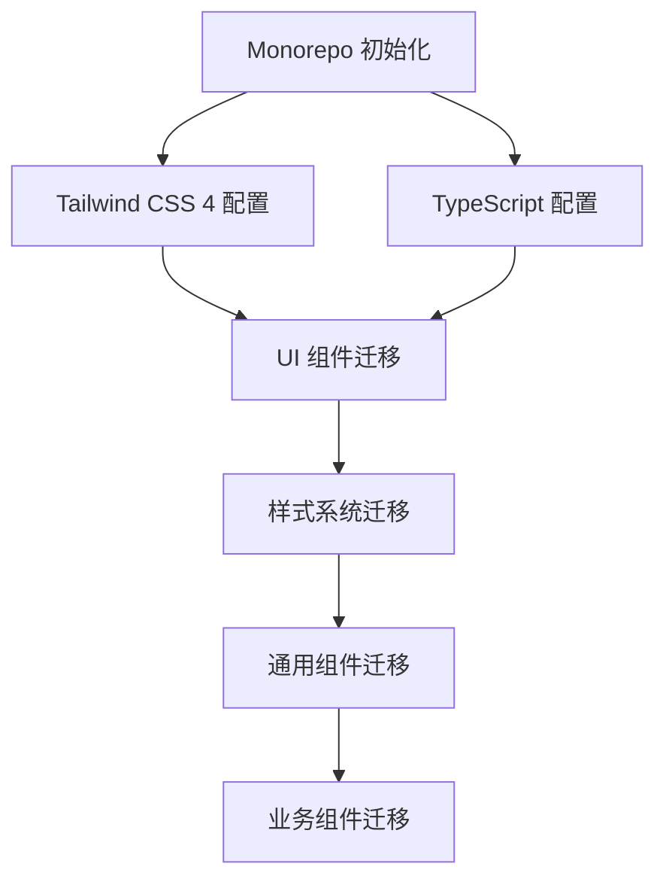
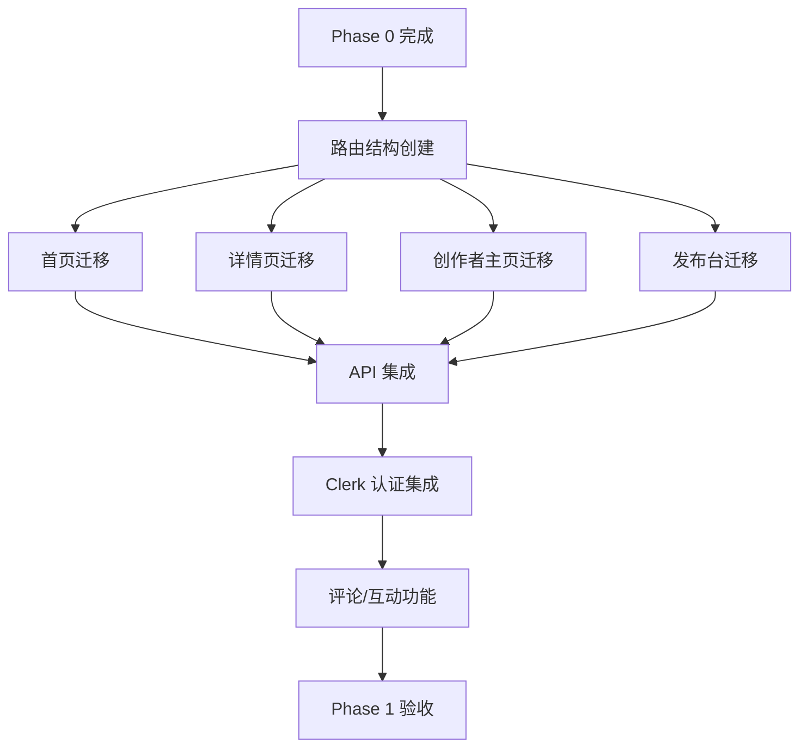
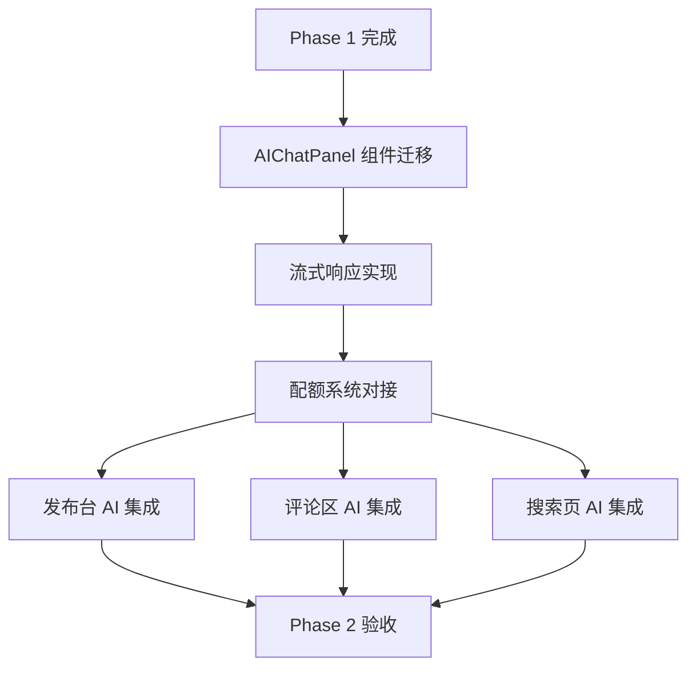
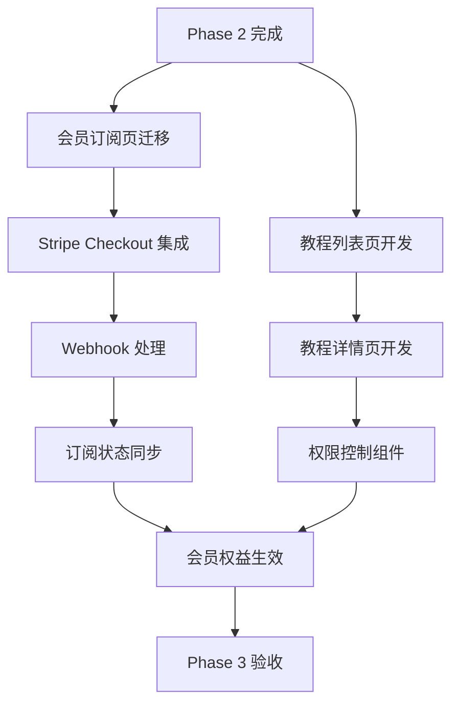
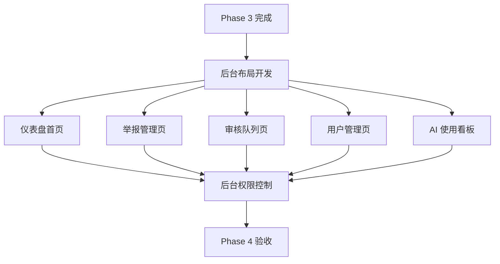

# EP-001-FE: 前端实施执行计划 v1.1

> 版本：v1.1
> 更新时间：2026-04-16
> 适用阶段：Phase 0-5
> 关联文档：[EP-001-foundation-setup.md](./EP-001-foundation-setup.md)、[ai_anime_community_execution_v1_optimized.md](../../design-docs/ai_anime_community_execution_v1_optimized.md)
> 文档目标：输出一份**可直接开工、可持续迭代、可被 AI/人类协作理解**的前端执行文档。

---

## 使用规则

1. 这份文档是**执行基线**，不是聊天记录摘要。
2. 新增重大设计决策时，不直接改口头结论，先补 `ADR`。
3. 代码改动若影响架构、API、组件结构，必须同步更新对应文档。
4. 如果文档与代码冲突，以**代码现状 + 最新 ADR** 为准，并立即修正文档。

---

## 0. 设计系统规范

### 0.1 美学方向

**核心定位：Editorial / Magazine Style（编辑/杂志风格）**

- **Tone**: 精致、文艺、有深度，类似高端艺术杂志
- **Typography**: Playfair Display (serif 标题) + Inter (sans 正文) - 已有
- **Color**: 纸张色背景 (#f4efeb) + 墨色文字 (#1a1918) + 赭红强调 (#c44d36)
- **Texture**: SVG noise 纹理模拟纸张质感
- **Motion**: 优雅的淡入淡出，staggered reveals，避免过度动画

### 0.2 设计令牌 (Design Tokens)

```css
/* 已有主题变量 - 保持一致 */
--font-sans: "Inter", system-ui, sans-serif;
--font-serif: "Playfair Display", "Noto Serif SC", Georgia, serif;

--color-paper: #f4efeb;
--color-paper-light: #fdfaf6;
--color-ink: #1a1918;
--color-ink-light: #4a4845;
--color-accent: #c44d36;

/* 需要补充的令牌 */
--color-success: #2d5a27;
--color-warning: #b8860b;
--color-error: #8b2500;
--color-info: #1e4d6b;

--spacing-xs: 0.25rem;
--spacing-sm: 0.5rem;
--spacing-md: 1rem;
--spacing-lg: 1.5rem;
--spacing-xl: 2rem;
--spacing-2xl: 3rem;

--radius-none: 0; /* Editorial style: no rounded corners */
--shadow-sm: 0 1px 2px rgba(26, 25, 24, 0.05);
--shadow-md: 0 4px 6px rgba(26, 25, 24, 0.07);
--shadow-lg: 0 10px 15px rgba(26, 25, 24, 0.1);
```

### 0.3 组件设计原则

1. **无圆角**: 所有按钮、卡片、输入框使用 `border-radius: 0`
2. **衬线标题**: 所有标题使用 Playfair Display
3. **斜体强调**: 使用 `font-style: italic` 作为强调方式
4. **边框分隔**: 使用细边框而非阴影分隔区域
5. **纸张纹理**: 关键容器使用 `.bg-texture-light` 类

---

## 1. Phase 0: 基础设施搭建

### 1.1 Monorepo 初始化

| 任务 | 优先级 | 预估 | 验收标准 |
|------|--------|------|----------|
| 创建 `apps/web` Next.js 项目 | P0 | 1h | `pnpm dev` 可启动 |
| 配置 Tailwind CSS 4 | P0 | 0.5h | 自定义令牌生效 |
| 配置 TypeScript strict mode | P0 | 0.5h | 无 any 类型错误 |

### 1.2 UI 组件迁移

**来源**: `docs/前端参考/Document-based design implementation/src/app/components/ui/`

| 任务 | 文件数 | 预估 | 验收标准 |
|------|--------|------|----------|
| 复制 48 个 shadcn/ui 组件 | 48 | 2h | 所有组件可导入使用 |
| 覆盖默认样式为 Editorial 风格 | 48 | 2h | 无圆角、边框风格一致 |
| 创建 `cn` 工具函数 | 1 | 0.5h | `cn('class1', 'class2')` 正常工作 |

**关键修改点**:
```tsx
// button.tsx - 移除圆角
const buttonVariants = cva(
  "inline-flex items-center justify-center ... border",
  {
    variants: {
      variant: {
        default: "bg-[#1a1918] text-[#fdfaf6] hover:bg-[#4a4845]",
        outline: "border-[#1a1918] bg-transparent hover:bg-[#1a1918] hover:text-[#fdfaf6]",
        ghost: "hover:bg-[#1a1918]/10",
      },
    },
  }
)
```

### 1.3 样式系统迁移

| 任务 | 来源 | 目标 | 验收标准 |
|------|------|------|----------|
| 字体定义 | `styles/fonts.css` | `src/styles/fonts.css` | Playfair Display 加载成功 |
| 主题变量 | `styles/theme.css` | `src/styles/theme.css` | CSS 变量可引用 |
| 全局样式 | `styles/tailwind.css` | `src/styles/globals.css` | 纸张纹理背景可见 |

### 1.4 通用组件迁移

| 组件 | 来源 | 目标 | 验收标准 |
|------|------|------|----------|
| Header | `components/Header.tsx` | `components/common/Header.tsx` | 导航栏显示正确 |
| Layout | `components/Layout.tsx` | `components/common/Layout.tsx` | 页面布局正常 |
| ImageWithFallback | `components/figma/ImageWithFallback.tsx` | `components/common/ImageWithFallback.tsx` | 图片加载失败显示占位 |

### 1.5 业务组件迁移

| 组件 | 来源 | 目标 | 验收标准 |
|------|------|------|----------|
| WorkCard | `components/WorkCard.tsx` | `components/domain/WorkCard.tsx` | 作品卡片渲染正确 |
| CommentSection | `components/CommentSection.tsx` | `components/domain/CommentSection.tsx` | 评论列表显示正常 |
| AIChatPanel | `components/AIChatPanel.tsx` | `components/domain/AIChatPanel.tsx` | AI 面板交互正常 |

### Phase 0 DoD

- [ ] `pnpm dev` 启动无错误
- [ ] 所有 UI 组件可导入使用
- [ ] 主题变量正确应用
- [ ] 纸张纹理背景可见
- [ ] Header + Layout 组件可用

### Phase 0 验收标准

1. 执行 `pnpm dev` 后访问 `http://localhost:3000` 无报错
2. 所有 48 个 shadcn/ui 组件可正常导入
3. CSS 变量 `--color-paper`、`--color-ink`、`--color-accent` 生效
4. 页面背景显示纸张纹理 (`.bg-texture-light`)
5. Header 导航栏和 Layout 布局壳正常渲染

### Phase 0 依赖关系



---

## 2. Phase 1: 社区 MVP

### 2.1 路由结构

```
apps/web/src/app/
├── (feed)/                    # 瀑布流布局组
│   ├── page.tsx               # 首页 /
│   ├── following/page.tsx     # 关注流 /following
│   ├── trending/page.tsx      # 热门流 /trending
│   └── tags/[slug]/page.tsx   # 标签页 /tags/anime
├── post/[postId]/
│   └── page.tsx               # 作品详情 /post/abc123
├── creator/[handle]/
│   └── page.tsx               # 创作者主页 /creator/artist
├── studio/
│   ├── page.tsx               # 发布台 /studio
│   └── edit/[postId]/page.tsx # 编辑作品 /studio/edit/abc123
├── auth/
│   ├── sign-in/page.tsx       # 登录 /auth/sign-in
│   └── sign-up/page.tsx       # 注册 /auth/sign-up
├── settings/
│   ├── page.tsx               # 设置 /settings
│   ├── profile/page.tsx       # 编辑资料 /settings/profile
│   └── subscription/page.tsx  # 订阅管理 /settings/subscription
├── search/
│   └── page.tsx               # 搜索 /search
└── api/
    ├── webhooks/
    │   ├── stripe/route.ts
    │   └── clerk/route.ts
    └── uploads/
        ├── sign/route.ts
        └── complete/route.ts
```

### 2.2 页面迁移计划

#### 2.2.1 首页 `/` (P0)

**来源**: `docs/前端参考/.../pages/Home.tsx`

| 任务 | 预估 | 验收标准 |
|------|------|----------|
| 创建 `(feed)` 路由组 | 0.5h | 路由正常工作 |
| 迁移瀑布流布局 | 1h | Masonry 布局正确 |
| 迁移分类筛选 | 1h | 分类切换正常 |
| 迁移排序功能 | 0.5h | 排序切换正常 |
| 迁移筛选面板 | 1h | 筛选面板展开/收起正常 |
| 对接后端 API | 2h | 数据从 API 获取 |
| 实现无限滚动 | 1h | 滚动加载更多 |

**技术要点**:
```tsx
// 使用 Server Component 获取初始数据
export default async function HomePage() {
  const initialWorks = await getWorks({ limit: 20 });
  return <HomeClient initialWorks={initialWorks} />;
}

// Client Component 处理交互
'use client';
function HomeClient({ initialWorks }: { initialWorks: Work[] }) {
  const { data, fetchNextPage } = useInfiniteQuery({
    queryKey: ['works'],
    queryFn: ({ pageParam }) => getWorks({ cursor: pageParam }),
    initialData: { pages: [initialWorks], pageParams: [null] },
  });
  // ...
}
```

#### 2.2.2 作品详情页 `/post/[postId]` (P0)

**来源**: `docs/前端参考/.../pages/WorkDetail.tsx`

| 任务 | 预估 | 验收标准 |
|------|------|----------|
| 创建动态路由页面 | 0.5h | 路由参数正确获取 |
| 迁移作品展示区 | 1h | 图片/描述显示正确 |
| 迁移评论区 | 1.5h | 评论列表/发表正常 |
| 迁移点赞/收藏 | 1h | 互动状态正确 |
| 实现分享功能 | 0.5h | 分享链接可复制 |
| 对接后端 API | 2h | 数据从 API 获取 |

**SEO 优化**:
```tsx
export async function generateMetadata({ params }): Promise<Metadata> {
  const post = await getPost(params.postId);
  return {
    title: `${post.title} | AI Anime Community`,
    description: post.excerpt,
    openGraph: {
      images: [post.coverImage],
    },
  };
}
```

#### 2.2.3 创作者主页 `/creator/[handle]` (P1)

**来源**: `docs/前端参考/.../pages/Profile.tsx`

| 任务 | 预估 | 验收标准 |
|------|------|----------|
| 创建动态路由页面 | 0.5h | handle 参数正确 |
| 迁移个人信息区 | 1h | 头像/简介/统计显示 |
| 迁移作品列表 | 1h | 作品网格正确 |
| 实现关注功能 | 1h | 关注状态正确 |
| 对接后端 API | 1.5h | 数据从 API 获取 |

#### 2.2.4 发布台 `/studio` (P1)

**来源**: `docs/前端参考/.../pages/Upload.tsx`

| 任务 | 预估 | 验收标准 |
|------|------|----------|
| 创建发布页面 | 0.5h | 路由正常 |
| 实现图片上传 | 2h | 直传 S3 成功 |
| 实现表单验证 | 1h | Zod schema 验证 |
| 实现标签选择 | 1h | 标签选择/创建正常 |
| 实现草稿保存 | 1h | 草稿可保存 |
| 对接后端 API | 2h | 发布成功 |

**上传流程**:
```tsx
// 1. 获取签名 URL
const { signedUrl, assetId } = await fetch('/api/uploads/sign', {
  method: 'POST',
  body: JSON.stringify({ filename, contentType }),
});

// 2. 直传 S3
await fetch(signedUrl, {
  method: 'PUT',
  body: file,
  headers: { 'Content-Type': file.type },
});

// 3. 确认上传完成
await fetch('/api/uploads/complete', {
  method: 'POST',
  body: JSON.stringify({ assetId }),
});
```

#### 2.2.5 登录/注册页 (P1)

**新增页面** - 使用 Clerk

| 任务 | 预估 | 验收标准 |
|------|------|----------|
| 集成 Clerk | 1h | Clerk Provider 配置 |
| 创建登录页 | 1h | 登录表单正常 |
| 创建注册页 | 1h | 注册表单正常 |
| 实现跳转逻辑 | 0.5h | 登录后跳转正确 |

```tsx
// apps/web/src/app/auth/sign-in/page.tsx
import { SignIn } from '@clerk/nextjs';

export default function SignInPage() {
  return (
    <div className="min-h-[80vh] flex items-center justify-center">
      <SignIn
        appearance={{
          elements: {
            card: 'bg-[#fdfaf6] border border-[#1a1918]/20 shadow-none',
            headerTitle: 'editorial-title text-3xl',
            formButtonPrimary: 'bg-[#1a1918] hover:bg-[#4a4845] rounded-none',
          },
        }}
      />
    </div>
  );
}
```

#### 2.2.6 设置页 (P2)

**新增页面**

| 任务 | 预估 | 验收标准 |
|------|------|----------|
| 创建设置布局 | 0.5h | 侧边栏导航正常 |
| 创建个人资料页 | 1h | 表单提交正常 |
| 创建订阅管理页 | 1h | 订阅状态显示正确 |

### 2.3 状态管理

| Store | 用途 | 技术 |
|-------|------|------|
| `useAuthStore` | 用户认证状态 | Zustand |
| `useUploadStore` | 上传状态 | Zustand |
| `useUIStore` | UI 状态 (侧边栏等) | Zustand |

**最小化状态管理**:
- 服务器状态 → TanStack Query
- 表单状态 → React Hook Form
- 全局 UI 状态 → Zustand

### 2.4 API 集成

| 模块 | 端点 | 方法 |
|------|------|------|
| 用户 | `/api/v1/me` | GET |
| 作品 | `/api/v1/posts` | GET, POST |
| 评论 | `/api/v1/posts/{id}/comments` | GET, POST |
| 上传 | `/api/v1/uploads/sign` | POST |

**SDK 结构**:
```tsx
// packages/sdk/src/posts.ts
export const postsApi = {
  list: (params?: PostsQuery) => fetchJSON('/api/v1/posts', { params }),
  get: (id: string) => fetchJSON(`/api/v1/posts/${id}`),
  create: (data: CreatePostInput) => fetchJSON('/api/v1/posts', {
    method: 'POST',
    body: JSON.stringify(data),
  }),
};
```

### Phase 1 DoD

- [ ] 首页瀑布流正常显示
- [ ] 作品详情页可访问
- [ ] 创作者主页可访问
- [ ] 发布台可上传作品
- [ ] 登录/注册流程正常
- [ ] 评论/点赞/收藏功能正常

### Phase 1 验收标准

1. 首页 `/` 加载 20 个作品卡片，Masonry 布局正确
2. 作品详情页 `/post/[postId]` 显示作品图片、标题、描述、评论区
3. 创作者主页 `/creator/[handle]` 显示创作者信息和作品列表
4. 发布台 `/studio` 可上传图片、填写表单、提交发布
5. Clerk 登录/注册流程正常，登录后跳转正确
6. 点赞、收藏按钮状态正确切换，评论可发表

### Phase 1 页面迁移来源映射

| 目标路由 | 来源文件 | 迁移状态 | 优先级 |
|----------|----------|----------|--------|
| `/` (首页) | `docs/前端参考/.../pages/Home.tsx` | 待迁移 | P0 |
| `/post/[postId]` | `docs/前端参考/.../pages/WorkDetail.tsx` | 待迁移 | P0 |
| `/creator/[handle]` | `docs/前端参考/.../pages/Profile.tsx` | 待迁移 | P1 |
| `/studio` | `docs/前端参考/.../pages/Upload.tsx` | 待迁移 | P1 |
| `/member` | `docs/前端参考/.../pages/Pricing.tsx` | 待迁移 | P2 |
| `/discover` | `docs/前端参考/.../pages/Discover.tsx` | 待迁移 | P2 |
| `/auth/sign-in` | Clerk 组件 | 待开发 | P1 |
| `/auth/sign-up` | Clerk 组件 | 待开发 | P1 |
| `/settings` | 新增 | 待开发 | P2 |
| `/settings/profile` | 新增 | 待开发 | P2 |
| `/settings/subscription` | 新增 | 待开发 | P2 |
| `/tags/[slug]` | 新增 (Home 有筛选) | 待开发 | P2 |
| `/search` | 新增 | 待开发 | P2 |

### Phase 1 组件迁移来源映射

| 目标位置 | 来源文件 | 迁移状态 |
|----------|----------|----------|
| `components/common/Header.tsx` | `docs/前端参考/.../components/Header.tsx` | 待迁移 |
| `components/common/Layout.tsx` | `docs/前端参考/.../components/Layout.tsx` | 待迁移 |
| `components/common/ImageWithFallback.tsx` | `docs/前端参考/.../components/figma/ImageWithFallback.tsx` | 待迁移 |
| `components/domain/WorkCard.tsx` | `docs/前端参考/.../components/WorkCard.tsx` | 待迁移 |
| `components/domain/CommentSection.tsx` | `docs/前端参考/.../components/CommentSection.tsx` | 待迁移 |
| `components/domain/AIChatPanel.tsx` | `docs/前端参考/.../components/AIChatPanel.tsx` | 待迁移 |
| `components/ui/*` (48 个) | `docs/前端参考/.../components/ui/*` | 待迁移 |

### Phase 1 依赖关系



---

## 3. Phase 2: AI 工具层

### 3.1 AI 聊天面板

**来源**: `docs/前端参考/.../components/AIChatPanel.tsx`

| 任务 | 预估 | 验收标准 |
|------|------|----------|
| 迁移 AI 面板组件 | 1.5h | 面板显示正常 |
| 实现流式响应 | 2h | 打字机效果正常 |
| 实现配额显示 | 1h | 配额余额显示 |
| 对接后端 API | 2h | AI 生成正常 |

**流式响应实现**:
```tsx
async function generateAIContent(prompt: string) {
  const response = await fetch('/api/v1/ai/write-post', {
    method: 'POST',
    body: JSON.stringify({ prompt }),
  });

  const reader = response.body?.getReader();
  const decoder = new TextDecoder();

  while (reader) {
    const { done, value } = await reader.read();
    if (done) break;
    const chunk = decoder.decode(value);
    // 处理 SSE 格式
    setContent(prev => prev + chunk);
  }
}
```

### 3.2 AI 功能集成点

| 位置 | 功能 | API |
|------|------|-----|
| 发布台 | AI 生成描述 | `POST /api/v1/ai/write-post` |
| 评论框 | AI 生成评论 | `POST /api/v1/ai/write-comment` |
| 搜索页 | AI 站内问答 | `POST /api/v1/ai/site-search` |
| Discover 页 | AI 策展 | `POST /api/v1/ai/site-search` |

### Phase 2 DoD

- [ ] AI 面板可正常打开
- [ ] AI 生成内容显示正常
- [ ] 配额消耗正确显示
- [ ] 流式响应打字机效果正常

### Phase 2 验收标准

1. 点击 AI 辅助按钮，AIChatPanel 面板正常打开
2. 输入提示词，AI 生成的文字以打字机效果逐字显示
3. 生成完成后，配额余额更新显示正确
4. AI 生成的文字可复制/回填到表单

### Phase 2 功能集成点

| 页面位置 | 功能 | API 端点 | 触发方式 |
|----------|------|----------|----------|
| 发布台 `/studio` | AI 生成作品描述 | `POST /api/v1/ai/write-post` | 点击"AI 辅助"按钮 |
| 作品详情页评论区 | AI 生成评论 | `POST /api/v1/ai/write-comment` | 点击"AI 生成评论"按钮 |
| 搜索页 `/search` | AI 站内问答 | `POST /api/v1/ai/site-search` | 输入问题提交 |
| Discover 页 `/discover` | AI 策展推荐 | `POST /api/v1/ai/site-search` | 页面加载时推荐 |

### Phase 2 依赖关系



---

## 4. Phase 3: 教程与订阅

### 4.1 会员订阅页 `/member`

**来源**: `docs/前端参考/.../pages/Pricing.tsx`

| 任务 | 预估 | 验收标准 |
|------|------|----------|
| 迁移定价页面 | 1.5h | 套餐卡片显示正确 |
| 集成 Stripe Checkout | 2h | 支付跳转正常 |
| 实现订阅状态显示 | 1h | 当前订阅显示 |

### 4.2 教程系统

| 页面 | 路由 | 预估 |
|------|------|------|
| 教程列表 | `/tutorial` | 2h |
| 教程详情 | `/tutorial/[slug]` | 3h |
| 试看逻辑 | - | 1h |

**权限控制**:
```tsx
function TutorialAccessGate({ tutorial, children }) {
  const { user } = useAuth();
  const hasAccess = tutorial.accessLevel === 'public'
    || user?.entitlements.includes('tutorial.member');

  if (!hasAccess) {
    return <UpgradePrompt />;
  }

  return children;
}
```

### Phase 3 DoD

- [ ] 会员套餐显示正确
- [ ] Stripe Checkout 流程正常
- [ ] 教程列表/详情页可用
- [ ] 会员权限控制正常

### Phase 3 验收标准

1. 会员订阅页 `/member` 显示 basic_monthly、pro_monthly 套餐卡片
2. 点击订阅按钮跳转 Stripe Checkout，支付成功后回调正确
3. 教程列表页 `/tutorial` 显示所有教程，教程详情页 `/tutorial/[slug]` 可访问
4. 非会员访问会员教程时显示升级提示，会员可正常访问

### Phase 3 页面开发清单

| 页面 | 路由 | 来源 | 预估工时 | 状态 |
|------|------|------|----------|------|
| 会员订阅页 | `/member` | `Pricing.tsx` | 3h | 待迁移 |
| 教程列表页 | `/tutorial` | 新增 | 2h | 待开发 |
| 教程详情页 | `/tutorial/[slug]` | 新增 | 3h | 待开发 |
| 订阅管理页 | `/settings/subscription` | 新增 | 2h | 待开发 |

### Phase 3 Stripe 集成要点

```tsx
// 1. 创建 Checkout Session
const { sessionUrl } = await fetch('/api/v1/subscriptions/checkout', {
  method: 'POST',
  body: JSON.stringify({ planId: 'pro_monthly' }),
});

// 2. 跳转 Stripe
window.location.href = sessionUrl;

// 3. Webhook 处理 (后端)
// stripe/webhook -> payment_events 入库 -> subscriptions 状态同步 -> entitlements 更新
```

### Phase 3 依赖关系



---

## 5. Phase 4: 后台管理

### 5.1 后台布局

```
apps/web/src/app/admin/
├── layout.tsx              # 后台布局 (侧边栏)
├── page.tsx                # 仪表盘
├── reports/page.tsx        # 举报管理
├── moderation/page.tsx     # 审核队列
├── users/page.tsx          # 用户管理
└── ai-usage/page.tsx       # AI 使用看板
```

### 5.2 权限控制

```tsx
// middleware.ts
export function middleware(request: NextRequest) {
  const { userId, sessionClaims } = auth();

  if (!userId) {
    return NextResponse.redirect(new URL('/auth/sign-in', request.url));
  }

  if (request.nextUrl.pathname.startsWith('/admin')) {
    const role = sessionClaims?.role;
    if (role !== 'admin') {
      return NextResponse.redirect(new URL('/', request.url));
    }
  }
}
```

### Phase 4 DoD

- [ ] 后台布局正常
- [ ] 举报列表可查看
- [ ] 审核操作可执行
- [ ] AI 使用统计可查看

### Phase 4 验收标准

1. 管理员登录后可访问后台 `/admin`，侧边栏导航正常
2. 举报列表 `/admin/reports` 显示所有举报，状态筛选正常
3. 审核队列 `/admin/moderation` 可对内容执行通过/拒绝操作
4. AI 使用看板 `/admin/ai-usage` 显示调用统计图表

### Phase 4 页面开发清单

| 页面 | 路由 | 功能 | 预估工时 | 状态 |
|------|------|------|----------|------|
| 后台首页 | `/admin` | 概览仪表盘 | 3h | 待开发 |
| 举报列表 | `/admin/reports` | 举报管理与流转 | 4h | 待开发 |
| 审核队列 | `/admin/moderation` | 内容审核操作 | 4h | 待开发 |
| 用户管理 | `/admin/users` | 用户列表与封禁 | 3h | 待开发 |
| AI 使用看板 | `/admin/ai-usage` | AI 调用统计 | 3h | 待开发 |

### Phase 4 后台布局结构

```
apps/web/src/app/admin/
├── layout.tsx              # 后台布局 (侧边栏 + 主内容区)
│   ├── Sidebar             # 左侧导航 (固定)
│   └── Header              # 顶部栏 (用户信息)
├── page.tsx                # 仪表盘首页
│   ├── StatsCards          # 关键指标卡片
│   ├── RecentReports       # 最近举报
│   └── AIUsageChart        # AI 使用趋势
├── reports/page.tsx        # 举报管理
│   ├── ReportsTable        # 举报列表表格
│   └── ReportDetailModal   # 举报详情弹窗
├── moderation/page.tsx     # 审核队列
│   ├── ModerationQueue     # 待审核列表
│   ├── ContentPreview      # 内容预览
│   └── ActionButtons       # 操作按钮 (通过/拒绝)
├── users/page.tsx          # 用户管理
│   ├── UsersTable          # 用户列表
│   └── UserDetailModal     # 用户详情
└── ai-usage/page.tsx       # AI 使用看板
    ├── UsageChart          # 使用趋势图
    ├── TopUsersTable       # 高频用户
    └── QuotaStats          # 配额统计
```

### Phase 4 依赖关系



---

## 6. 性能优化

### 6.1 图片优化

```tsx
import Image from 'next/image';

// 使用 Next.js Image 组件
<Image
  src={work.coverImage}
  alt={work.title}
  width={400}
  height={600}
  placeholder="blur"
  blurDataURL={work.blurhash}
  loading="lazy"
/>
```

### 6.2 代码分割

```tsx
// 动态导入大型组件
const AIChatPanel = dynamic(
  () => import('@/components/domain/AIChatPanel'),
  { ssr: false }
);
```

### 6.3 缓存策略

| 数据类型 | 缓存时间 | 策略 |
|----------|----------|------|
| 作品列表 | 1 分钟 | stale-while-revalidate |
| 作品详情 | 5 分钟 | stale-while-revalidate |
| 用户信息 | 10 分钟 | cache-first |
| 静态配置 | 1 小时 | cache-first |

---

## 7. 可访问性 (A11y)

### 7.1 必须满足

- [ ] 所有图片有 alt 文本
- [ ] 表单有 label 关联
- [ ] 键盘可导航
- [ ] 焦点可见
- [ ] 颜色对比度 ≥ 4.5:1

### 7.2 测试工具

```bash
# 运行 axe-core 测试
pnpm test:a11y
```

---

## 8. 测试覆盖

### 8.1 单元测试

| 模块 | 覆盖率 | 工具 |
|------|--------|------|
| 工具函数 | 100% | Vitest |
| Hooks | 80% | Vitest + Testing Library |
| 组件 | 60% | Vitest + Testing Library |

### 8.2 E2E 测试

| 流程 | 优先级 | 工具 |
|------|--------|------|
| 登录流程 | P0 | Playwright |
| 发布作品 | P0 | Playwright |
| 评论互动 | P1 | Playwright |
| 订阅支付 | P1 | Playwright |

---

## 9. 开发规范

### 9.1 文件命名

```
components/
├── ui/           # 小写 kebab-case: button.tsx
├── common/       # PascalCase: Header.tsx
└── domain/       # PascalCase: WorkCard.tsx
```

### 9.2 组件结构

```tsx
// 1. 导入
import { useState } from 'react';
import { cn } from '@/lib/utils';

// 2. 类型定义
interface WorkCardProps {
  work: Work;
  onSelect?: (id: string) => void;
}

// 3. 组件
export function WorkCard({ work, onSelect }: WorkCardProps) {
  // hooks
  const [isHovered, setIsHovered] = useState(false);

  // handlers
  const handleClick = () => onSelect?.(work.id);

  // render
  return (
    <article
      className={cn(
        "border border-[#1a1918]/20 bg-texture-light",
        isHovered && "shadow-md"
      )}
      onMouseEnter={() => setIsHovered(true)}
      onMouseLeave={() => setIsHovered(false)}
    >
      {/* ... */}
    </article>
  );
}
```

### 9.3 禁止事项

- ❌ 页面直接拼接 API URL
- ❌ 组件内散落 AI 模型调用
- ❌ 所有状态塞进 Zustand
- ❌ page.tsx 写大量业务逻辑
- ❌ 前端自行判断 Stripe 最终权限

---

## 10. 迁移检查清单

### Phase 0 完成检查

- [ ] `pnpm dev` 无错误启动
- [ ] 所有 UI 组件可用
- [ ] 主题变量正确
- [ ] Header/Layout 组件可用

### Phase 1 完成检查

- [ ] 首页瀑布流正常
- [ ] 作品详情页可访问
- [ ] 发布台可上传
- [ ] 登录/注册正常

### Phase 2 完成检查

- [ ] AI 面板可用
- [ ] 流式响应正常
- [ ] 配额显示正确

### Phase 3 完成检查

- [ ] 会员订阅正常
- [ ] 教程访问控制正常

### Phase 4 完成检查

- [ ] 后台管理可用
- [ ] 权限控制正确

---

## 11. 技术栈确认

### 11.1 前端技术栈

| 类别 | 技术 | 版本 | 用途 |
|------|------|------|------|
| 框架 | Next.js | 15.x | App Router、Server Components |
| 语言 | TypeScript | 5.x | 类型安全 |
| 样式 | Tailwind CSS | 4.x | Utility-first CSS |
| UI 组件 | shadcn/ui | latest | 无样式组件库 |
| 图标 | Lucide React | latest | 图标库 |
| 动画 | Motion | latest | 动画库 (原 Framer Motion) |
| 状态管理 | Zustand | 5.x | 全局 UI 状态 |
| 数据获取 | TanStack Query | 5.x | 服务器状态管理 |
| 表单 | React Hook Form | 7.x | 表单管理 |
| 验证 | Zod | 3.x | Schema 验证 |
| 认证 | Clerk | latest | 用户认证 |

### 11.2 工具链

| 工具 | 用途 |
|------|------|
| pnpm | 包管理 + Monorepo |
| Turborepo | 构建缓存 |
| ESLint | 代码检查 |
| Prettier | 代码格式化 |
| Husky | Git Hooks |
| lint-staged | 提交前检查 |
| Vitest | 单元测试 |
| Playwright | E2E 测试 |

---

## 12. 关键决策记录 (ADR 引用)

| ADR | 标题 | 说明 |
|-----|------|------|
| [ADR-001](../../adr/ADR-001-monorepo.md) | Monorepo 架构 | 采用 pnpm workspace + Turborepo |
| [ADR-002](../../adr/ADR-002-nextjs-fastapi-split.md) | Next.js + FastAPI 分离 | 前端 BFF + 后端 API 分离 |
| [ADR-003](../../adr/ADR-003-postgres-search-strategy.md) | Postgres 混合检索 | v1 不引入 Elasticsearch |

---

*文档版本：v1.1*
*更新时间：2026-04-16*
*维护者：前端团队*
